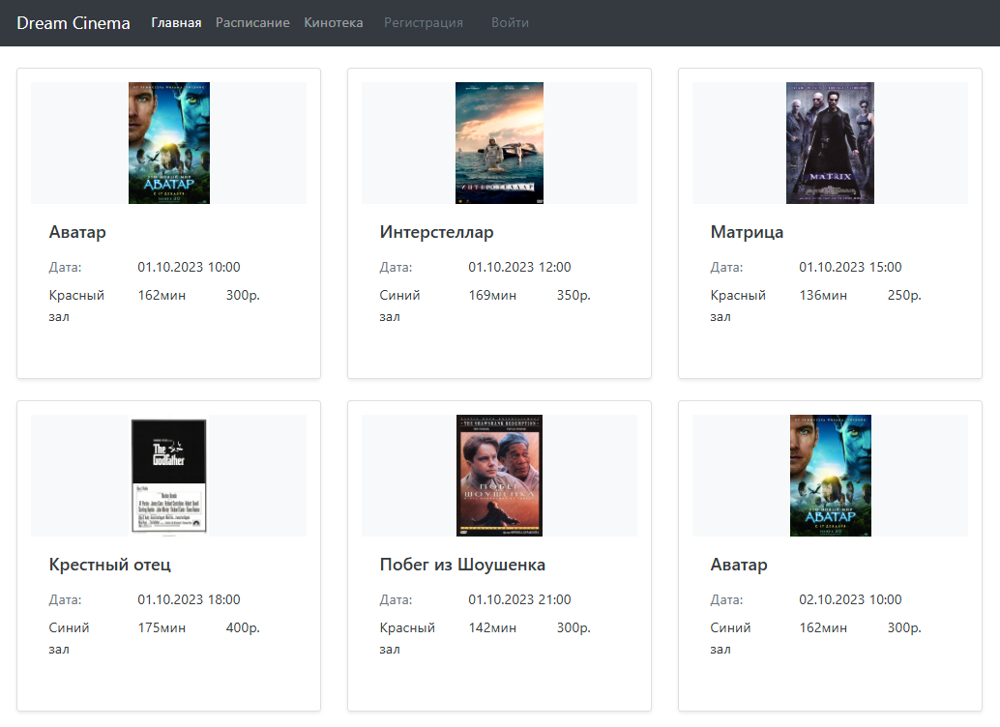
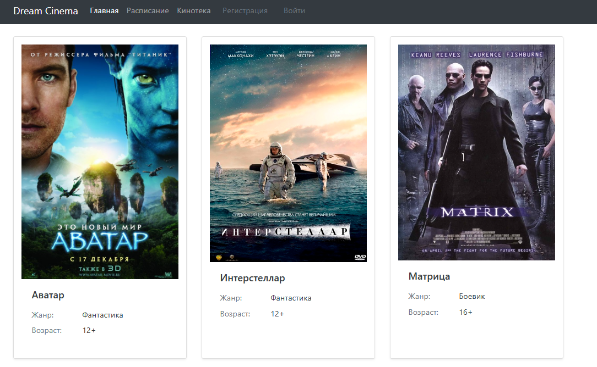
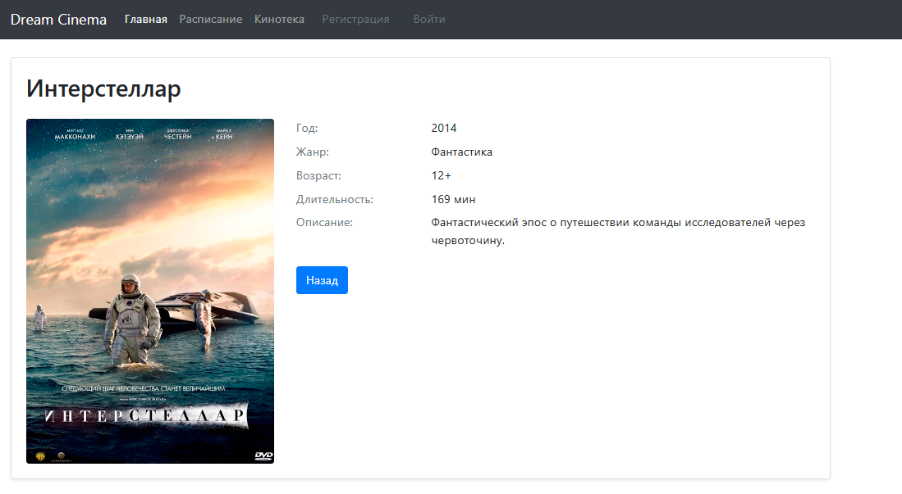
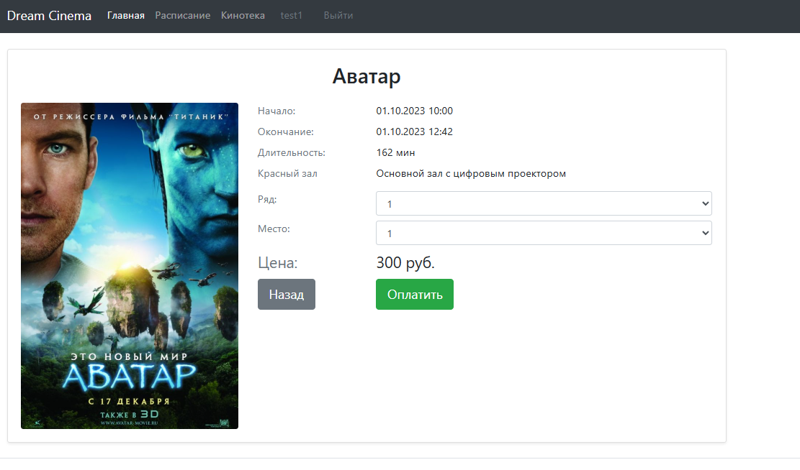
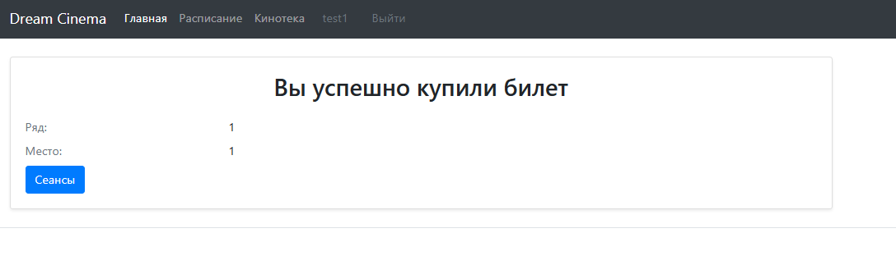
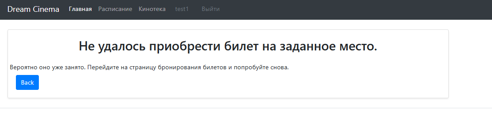
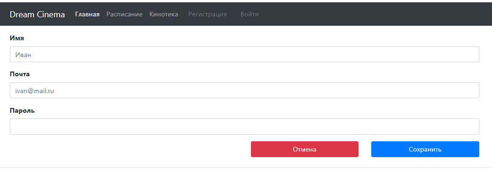
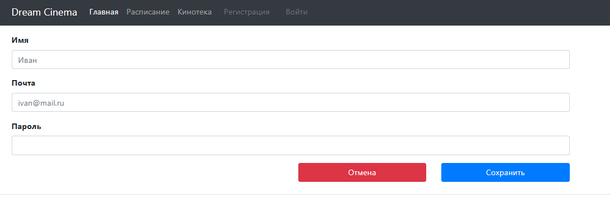

# job4j_cinema

## Описание проекта
Сайт кинотеатра. Позволяет пользователям:
 - смотреть каталог фильмов;
 - Смотреть расписание сеансов;
 - покупать билеты на доступные места.

## Технологии
- Java 21
- Spring Boot
- Thymeleaf
- Bootstrap 5
- Sql2o
- PostgreSQL
- Liquibase

## Требования
- Java 21+
- Maven 3.8+
- PostgreSQL 15+


## Запуск проекта
1. Создать БД `cinema`;
2. Настроить параметры подключения в `application.properties`;
3. Запустить проект:
  ```bash
  mvn spring-boot:run
  ```
4. Открыть в браузере: http://localhost:8080


## Роли пользователей
- **Гость**: может просматривать расписание и фильмы.
- **Зарегистрированный пользователь**: может приобретать билеты.

## Взаимодействие с приложением

### **Главная страница**

### **Расписание — список сеансов с возможностью перейти к покупке:**

### **Кинотека — список фильмов:**

### **Карточка фильма:**

### **Покупка билета — выбор места, подтверждение:**

### **Успешная/неудачная покупка — сообщения об операции:**


### **Регистрация и вход:**


